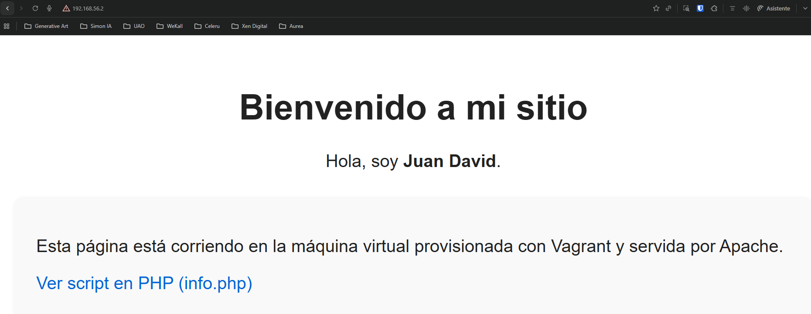
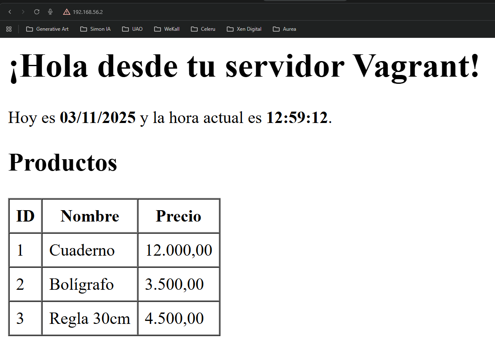

# Taller aprovisionamiento: Web + Base de Datos (Apache/PHP + PostgreSQL)

### Instalación rápida

1. Clonar el repositorio:

```bash
git clone https://github.com/juandavid764/vagrant-web-provisioning.git
cd vagrant-web-provisioning
```

2. Levantar las máquinas virtuales:

```bash
vagrant up web
vagrant up db
```

3. Forzar aprovisionamiento (si ya existen las VMs):

```bash
vagrant provision web
vagrant provision db
```

### Acceso desde el navegador

- Página principal (sitio web): <http://192.168.56.2/>  
- Página PHP con conexión a PostgreSQL: <http://192.168.56.2/info.php>

### Scripts de aprovisionamiento

- provision-web.sh
  - Instala y configura Apache y PHP.
  - Habilita la extensión para PostgreSQL (php-pgsql).
  - Copia los archivos del sitio desde la carpeta `www/` al directorio web.
  - Ajusta permisos y arranca el servicio de Apache.

- provision-db.sh
  - Instala PostgreSQL.
  - Ajusta la configuración para permitir conexiones desde la red privada.
  - Crea usuario, base de datos y tablas de ejemplo, e inserta datos de prueba.

### Conexión a la base de datos (desde la VM web)

| Parámetro     | Valor            |
|---------------|------------------|
| Host          | 192.168.56.3     |
| Puerto        | 5432             |
| Base de datos | appdb            |
| Usuario       | appuser          |
| Contraseña    | appPass123       |

### Notas rápidas

- Asegúrate de tener instalados Vagrant y VirtualBox antes de ejecutar los comandos.  
- Si necesitas inspeccionar o depurar la provision, conecta por SSH a la VM: `vagrant ssh web` o `vagrant ssh db`.
- Los scripts de aprovisionamiento están en la raíz del proyecto para facilitar modificaciones y pruebas.
Este proyecto implementa un entorno completo de **servidor web y base de datos** usando **Vagrant** con **provisionamiento mediante scripts Shell**.

---

## 📁 Estructura del proyecto

vagrant/
├── Vagrantfile
├── provision-web.sh
├── provision-db.sh
├── www/
│ ├── index.html
│ └── info.php
└── README.md

---

## Objetivo

Automatizar la creación y configuración de dos máquinas virtuales:

- **web** → Servidor Apache con PHP.  
- **db** → Servidor PostgreSQL con base de datos y datos de ejemplo.

---

## Requisitos previos

- [Vagrant](https://developer.hashicorp.com/vagrant/downloads)
- [VirtualBox](https://www.virtualbox.org/wiki/Downloads)
- Git (para clonar el repositorio)

---

## Imágenes

Capturas de las páginas servidas por la VM web (las imágenes están en la carpeta `assets/`):

Imagen de la página principal (`index.html`) — Markdown:



Imagen de la página PHP (`info.php`) — Markdown:

